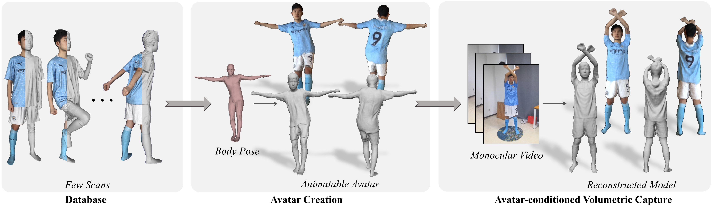

# AvatarCap: Animatable Avatar Conditioned Monocular Human Volumetric Capture (ECCV 2022)
[Zhe Li](http://lizhe00.github.io/), [Zerong Zheng](http://zhengzerong.github.io/), [Hongwen Zhang](https://hongwenzhang.github.io/), Chaonan Ji, [Yebin Liu](https://liuyebin.com)

[Paper](https://arxiv.org/abs/2207.02031) | [Project](https://liuyebin.com/avatarcap/avatarcap.html)



## Brief Introduction
To address the ill-posed problem caused by partial observations in monocular human volumetric capture,
we present AvatarCap, a framework that introduces animatable avatars into the capture pipeline
for high-fidelity reconstruction in both visible and invisible regions.

Using this repo, you can either create an animatable _**avatar**_ from several 3D scans of one character or
_**reconstruct**_ him/her using the avatar as a prior from a monocular video.

## Requirements
- Python 3
- [requirements.txt](./requirements.txt)
- CUDA tested on 11.1

## SMPL & Pretrained Models
- Download [SMPL file](https://smpl.is.tue.mpg.de/download.php), place pkl files to `./smpl_files`.
- Download [pretrained models](https://drive.google.com/file/d/18yH2LYRZQAUhSbxdAuDsEVDAcgG0z-PQ/view?usp=sharing), unzip it to ```./pretrained_models```. The contents of this folder are listed below:
```
./pretrained_models
├── avatar_net
│   └── example               # the avatar network of the character in the example dataset
│   └── example_finetune_tex  # the avatar network with more high-quality texture
├── recon_net                 # reconstruction network which is general to arbitrary subjects
├── normal_net                # normal estimation network used in data preprocessing
```

## Run on Example Dataset

### Example Dataset
- Download example dataset ([Google Drive](https://drive.google.com/file/d/1Z5PACvrN2b7sRRAwog0275rJLSB2OTG3/view?usp=sharing) or [Tsinghua Cloud](https://cloud.tsinghua.edu.cn/f/5ac495ec4b814bc99c78/?dl=1)) which contains training data generated from 22 3D scans of one character and testing data generated from a monocular RGB video.
This example dataset has been preprocessed and can be directly used for training and testing.
- Unzip it somewhere, denoted as ```EXAMPLE_DATA_DIR```.

### Train GeoTexAvatar
- Specify `training_data_dir` in `configs/example.yaml` as ```EXAMPLE_DATA_DIR/training```.
- Run the following script.
```
python main.py -c ./configs/example.yaml -m train
```
- Network checkpoints will be saved in ```./results/example/training```.

### Test AvatarCap or GeoTexAvatar
- Specify `testing_data_dir` in `configs/example.yaml` as ```EXAMPLE_DATA_DIR/testing```.
- Run the following script.
```
python main.py -c ./configs/example.yaml -m test
```
- Output results will be saved in ```./results/example/testing```

## Run on Customized Data
Check [DATA.md](./gen_data/DATA.md) for processing your own data.

## Acknowledgement
Some codes are based on [PIFuHD](https://github.com/facebookresearch/pifuhd), [pix2pixHD](https://github.com/NVIDIA/pix2pixHD), [SCANimate](https://github.com/shunsukesaito/SCANimate), [POP](https://github.com/qianlim/POP) and [Animatable NeRF](https://github.com/zju3dv/animatable_nerf). We thank the authors for their great work!

## License
MIT License. SMPL-related files are subject to the license of [SMPL](https://smpl.is.tue.mpg.de/modellicense.html).

## Citation
If you find our code, data or paper is useful to your research, please consider citing:
```bibtex
@InProceedings{li2022avatarcap,
    title={AvatarCap: Animatable Avatar Conditioned Monocular Human Volumetric Capture},
    author={Li, Zhe and Zheng, Zerong and Zhang, Hongwen and Ji, Chaonan and Liu, Yebin},
    booktitle={European Conference on Computer Vision (ECCV)},
    month={October},
    year={2022},
}
```